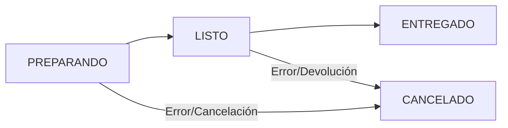

# 🧃 Máquina de Jugos con Arquitectura Hexagonal
## Spring Boot 3.5.3 + PostgreSQL + Java 21

[](https://www.oracle.com/java/)
[](https://spring.io/projects/spring-boot)
[](https://www.postgresql.org/)
[](https://alistair.cockburn.us/hexagonal-architecture/)

Este proyecto es una **simulación completa de una máquina que hace jugos naturales**, construida con **Spring Boot** usando el enfoque de **arquitectura hexagonal** (también conocida como Ports and Adapters). Todo el flujo, desde que un cliente hace un pedido por WhatsApp hasta que el jugo se guarda en la base de datos, está representado en código real, organizado y completamente documentado.

---

## ⚙️ **Configuración del Proyecto**

### 📋 **Requisitos Previos:**

```bash
# Versiones mínimas requeridas
Java 21+
Maven 3.8+
PostgreSQL 15+
Git 2.30+
```

### 🛠️ **Instalación y Configuración:**

#### 1️⃣ **Clonar el Repositorio:**
```bash
git clone https://github.com/anvorja/juice_machine
cd juice_machine
```

#### 2️⃣ **Configurar PostgreSQL:**
```sql
-- Crear base de datos
CREATE DATABASE nevera_jugos;

-- Crear usuario (opcional)
CREATE USER jugos_user WITH PASSWORD 'jugos_password';
GRANT ALL PRIVILEGES ON DATABASE nevera_jugos TO jugos_user;
```

#### 3️⃣ **Configurar application.yml:**
```yaml
spring:
  application:
    name: maquina-jugos

  datasource:
    url: jdbc:postgresql://localhost:5432/nevera_jugos
    username: postgres  # Cambiar por tu usuario
    password: tu_password  # Cambiar por tu contraseña
    driver-class-name: org.postgresql.Driver

  jpa:
    hibernate:
      ddl-auto: update  # Crea las tablas automáticamente
    show-sql: true
    properties:
      hibernate:
        dialect: org.hibernate.dialect.PostgreSQLDialect
        format_sql: true

server:
  port: 8080

# Configuración de logging para ver el flujo
logging:
  level:
    com.anborja.maquina_de_jugos: DEBUG
  pattern:
    console: "%d{yyyy-MM-dd HH:mm:ss} - %msg%n"
```

#### 4️⃣ **Compilar y Ejecutar:**
```bash
# Compilar el proyecto
mvn clean compile

# Ejecutar tests (cuando estén implementados)
mvn test

# Ejecutar la aplicación
mvn spring-boot:run

# O generar JAR y ejecutar
mvn clean package
java -jar target/Maquina_de_Jugos-0.0.1-SNAPSHOT.jar
```

#### 5️⃣ **Verificar que todo funciona:**
```bash
# Verificar que la aplicación esté corriendo
curl http://localhost:8080/api/jugos

# Acceder a la documentación Swagger
open http://localhost:8080/swagger-ui.html
```

---

## 📖 **Documentación Swagger/OpenAPI**

### 🌐 **URLs de Acceso:**
- **Swagger UI**: `http://localhost:8080/swagger-ui.html`
- **API Docs JSON**: `http://localhost:8080/api-docs`
- **API Docs YAML**: `http://localhost:8080/api-docs.yaml`

### 🏷️ **Organización por Tags:**

```java
@Configuration
public class OpenApiConfiguration {
    
    @Bean
    public OpenAPI customOpenAPI() {
        return new OpenAPI()
                .info(new Info()
                        .title("🍹 Máquina de Jugos API")
                        .description("API REST para gestión de una máquina de jugos naturales")
                        .version("1.0.0"))
                .tags(List.of(
                        new Tag()
                                .name("🍹 Gestión de Jugos")
                                .description("Operaciones CRUD principales"),
                        new Tag()
                                .name("🔍 Búsquedas")
                                .description("Filtrado por diferentes criterios"),
                        new Tag()
                                .name("📊 Reportes")
                                .description("Generación de estadísticas")
                ));
    }
}
```

### 📝 **Ejemplos en la Documentación:**

Cada endpoint incluye:
- ✅ Descripción detallada
- ✅ Parámetros y tipos de datos
- ✅ Ejemplos de request y response
- ✅ Códigos de estado HTTP
- ✅ Mensajes de error posibles

---

## 🧩 **Patrones de Diseño Implementados**

### 1️⃣ **Repository Pattern:**
```java
// Puerto (Interface)
public interface JugoRepositoryPort {
    JugoEntity guardar(JugoEntity jugo);
    Optional<JugoEntity> buscarPorId(Long id);
    List<JugoEntity> buscarTodos();
    // ... más métodos
}

// Adaptador (Implementación)
@Component
public class JugoRepositoryAdapter implements JugoRepositoryPort {
    
    private final JpaJugoRepository jpaRepository;
    
    @Override
    public JugoEntity guardar(JugoEntity jugo) {
        return jpaRepository.save(jugo);
    }
    // ... implementación de otros métodos
}
```

### 2️⃣ **Use Case Pattern:**
```java
@Service
@RequiredArgsConstructor
public class CrearJugoUseCase {
    
    private final JugoServicePort jugoService;
    private final JugoRepositoryPort repository;

    public JugoEntity ejecutar(PedidoDTO pedido) {
        // Lógica del caso de uso específico
        // Sin dependencias de tecnología
    }
}
```

### 3️⃣ **Adapter Pattern:**
```java
// El JugoRepositoryAdapter adapta JPA al dominio
// El JugoController adapta HTTP al dominio
```

### 4️⃣ **Factory Pattern:**
```java
@Component
public class JugoMapperFactory {
    
    public JugoEntity toEntity(PedidoDTO dto) {
        return new JugoEntity(/* mapping logic */);
    }
    
    public JugoResponseDTO toResponseDTO(JugoEntity entity) {
        return new JugoResponseDTO(/* mapping logic */);
    }
}
```

### 5️⃣ **Strategy Pattern:**
```java
// Diferentes estrategias de preparación por sabor
// Diferentes estrategias de cálculo de precio
```

---

## 🧪 **Testing Strategy (Para Implementar)**

### 🔬 **Estructura de Tests Sugerida:**

```
src/test/java/
├── unit/                           # Tests unitarios
│   ├── domain/
│   │   ├── JugoEntityTest.java
│   │   └── JugoPreparationServiceTest.java
│   ├── application/
│   │   ├── CrearJugoUseCaseTest.java
│   │   └── GenerarReporteUseCaseTest.java
│   └── infrastructure/
│       ├── JugoControllerTest.java
│       └── JugoRepositoryAdapterTest.java
├── integration/                    # Tests de integración
│   ├── JugoApiIntegrationTest.java
│   └── DatabaseIntegrationTest.java
└── e2e/                           # Tests end-to-end
    └── JugoFlowE2ETest.java
```

### 🧪 **Ejemplos de Tests:**

```java
// Test unitario del caso de uso
@ExtendWith(MockitoExtension.class)
class CrearJugoUseCaseTest {
    
    @Mock
    private JugoServicePort jugoService;
    
    @Mock
    private JugoRepositoryPort repository;
    
    @InjectMocks
    private CrearJugoUseCase useCase;
    
    @Test
    void deberiaCrearJugoExitosamente() {
        // Given
        PedidoDTO pedido = new PedidoDTO("mango", true, true, "granola", "grande", "María");
        JugoEntity jugoEsperado = new JugoEntity(/* ... */);
        
        when(jugoService.prepararJugo(any(), any(), any(), any(), any(), any()))
                .thenReturn(jugoEsperado);
        when(repository.guardar(any())).thenReturn(jugoEsperado);
        
        // When
        JugoEntity resultado = useCase.ejecutar(pedido);
        
        // Then
        assertThat(resultado).isNotNull();
        assertThat(resultado.getSabor()).isEqualTo("mango");
        verify(jugoService).prepararJugo(/* parámetros */);
        verify(repository).guardar(jugoEsperado);
    }
}

// Test de integración con TestContainers
@SpringBootTest
@Testcontainers
class DatabaseIntegrationTest {
    
    @Container
    static PostgreSQLContainer<?> postgres = new PostgreSQLContainer<>("postgres:15")
            .withDatabaseName("test_nevera_jugos")
            .withUsername("test")
            .withPassword("test");
    
    @Test
    void deberiaGuardarYBuscarJugo() {
        // Test con base de datos real
    }
}
```

---

## 🐳 **Containerización (Docker)**

### 📦 **Dockerfile:**

```dockerfile
# Dockerfile
FROM openjdk:21-jdk-slim

LABEL maintainer="tu-email@example.com"
LABEL description="Máquina de Jugos con Arquitectura Hexagonal"

WORKDIR /app

# Copiar el JAR de la aplicación
COPY target/Maquina_de_Jugos-0.0.1-SNAPSHOT.jar app.jar

# Crear usuario no-root para seguridad
RUN addgroup --system spring && adduser --system spring --ingroup spring
USER spring:spring

# Exponer puerto
EXPOSE 8080

# Configurar JVM para contenedores
ENV JAVA_OPTS="-XX:+UseContainerSupport -XX:MaxRAMPercentage=75.0"

# Comando de inicio
ENTRYPOINT ["sh", "-c", "java $JAVA_OPTS -jar app.jar"]
```

### 🐙 **docker-compose.yml:**

```yaml
version: '3.8'

services:
  # Base de datos PostgreSQL
  postgres:
    image: postgres:15-alpine
    container_name: maquina-jugos-db
    environment:
      POSTGRES_DB: nevera_jugos
      POSTGRES_USER: postgres
      POSTGRES_PASSWORD: superapostgres
    ports:
      - "5432:5432"
    volumes:
      - postgres_data:/var/lib/postgresql/data
      - ./init.sql:/docker-entrypoint-initdb.d/init.sql
    networks:
      - jugos-network

  # Aplicación Spring Boot
  app:
    build: .
    container_name: maquina-jugos-app
    depends_on:
      - postgres
    environment:
      SPRING_DATASOURCE_URL: jdbc:postgresql://postgres:5432/nevera_jugos
      SPRING_DATASOURCE_USERNAME: postgres
      SPRING_DATASOURCE_PASSWORD: superapostgres
    ports:
      - "8080:8080"
    networks:
      - jugos-network
    restart: unless-stopped

volumes:
  postgres_data:

networks:
  jugos-network:
    driver: bridge
```

### 🚀 **Comandos Docker:**

```bash
# Construir y ejecutar con Docker Compose
docker-compose up -d

# Ver logs de la aplicación
docker-compose logs -f app

# Parar todos los servicios
docker-compose down

# Reconstruir la imagen
docker-compose build --no-cache

# Ejecutar solo la base de datos
docker-compose up -d postgres
```

---

## 📊 **Monitoring y Observabilidad**

### 🔍 **Spring Boot Actuator:**

```yaml
# application.yml
management:
  endpoints:
    web:
      exposure:
        include: health,info,metrics,prometheus
  endpoint:
    health:
      show-details: always
  metrics:
    export:
      prometheus:
        enabled: true
```

### 📈 **Métricas Personalizadas:**

```java
@Component
@RequiredArgsConstructor
public class JugoMetrics {
    
    private final MeterRegistry meterRegistry;
    
    public void incrementarJugosCreados(String sabor) {
        Counter.builder("jugos.creados")
                .tag("sabor", sabor)
                .register(meterRegistry)
                .increment();
    }
    
    public void registrarTiempoPreparacion(String sabor, Duration tiempo) {
        Timer.builder("jugos.tiempo.preparacion")
                .tag("sabor", sabor)
                .register(meterRegistry)
                .record(tiempo);
    }
}
```

### 🎯 **Endpoints de Salud:**

```bash
# Verificar salud de la aplicación
curl http://localhost:8080/actuator/health

# Ver métricas
curl http://localhost:8080/actuator/metrics

# Métricas específicas
curl http://localhost:8080/actuator/metrics/jugos.creados
```

---

## 🔒 **Security (Para Implementar)**

### 🛡️ **Spring Security Básico:**

```java
@Configuration
@EnableWebSecurity
public class SecurityConfig {
    
    @Bean
    public SecurityFilterChain filterChain(HttpSecurity http) throws Exception {
        return http
                .csrf(csrf -> csrf.disable())
                .authorizeHttpRequests(auth -> auth
                        .requestMatchers("/api/jugos/**").hasRole("USER")
                        .requestMatchers("/actuator/**").hasRole("ADMIN")
                        .requestMatchers("/swagger-ui/**", "/api-docs/**").permitAll()
                        .anyRequest().authenticated()
                )
                .httpBasic(Customizer.withDefaults())
                .build();
    }
    
    @Bean
    public UserDetailsService userDetailsService() {
        UserDetails user = User.builder()
                .username("cliente")
                .password("{noop}password")
                .roles("USER")
                .build();
                
        UserDetails admin = User.builder()
                .username("admin")
                .password("{noop}admin")
                .roles("ADMIN")
                .build();
                
        return new InMemoryUserDetailsManager(user, admin);
    }
}
```

---

## 🚀 **Despliegue en Producción**

### ☁️ **Variables de Entorno:**

```bash
# Configuración para producción
export SPRING_PROFILES_ACTIVE=prod
export SPRING_DATASOURCE_URL=jdbc:postgresql://prod-db:5432/nevera_jugos
export SPRING_DATASOURCE_USERNAME=${DB_USERNAME}
export SPRING_DATASOURCE_PASSWORD=${DB_PASSWORD}
export SERVER_PORT=8080
export JAVA_OPTS="-Xmx512m -Xms256m"
```

### 🔧 **application-prod.yml:**

```yaml
spring:
  config:
    activate:
      on-profile: prod
  
  datasource:
    url: ${SPRING_DATASOURCE_URL}
    username: ${SPRING_DATASOURCE_USERNAME}
    password: ${SPRING_DATASOURCE_PASSWORD}
    
  jpa:
    hibernate:
      ddl-auto: validate  # No crear/modificar tablas en producción
    show-sql: false

logging:
  level:
    com.anborja.maquina_de_jugos: INFO
    org.springframework.web: WARN
  file:
    name: /logs/maquina-jugos.log
```

### 🏗️ **CI/CD Pipeline (GitHub Actions):**

```yaml
# .github/workflows/ci-cd.yml
name: CI/CD Pipeline

on:
  push:
    branches: [ main, develop ]
  pull_request:
    branches: [ main ]

jobs:
  test:
    runs-on: ubuntu-latest
    steps:
      - uses: actions/checkout@v3
      
      - name: Set up JDK 21
        uses: actions/setup-java@v3
        with:
          java-version: '21'
          distribution: 'temurin'
          
      - name: Cache Maven dependencies
        uses: actions/cache@v3
        with:
          path: ~/.m2
          key: ${{ runner.os }}-m2-${{ hashFiles('**/pom.xml') }}
          
      - name: Run tests
        run: mvn clean test
        
      - name: Run integration tests
        run: mvn verify -P integration-tests

  build-and-deploy:
    needs: test
    runs-on: ubuntu-latest
    if: github.ref == 'refs/heads/main'
    
    steps:
      - uses: actions/checkout@v3
      
      - name: Build Docker image
        run: |
          docker build -t maquina-jugos:${{ github.sha }} .
          docker tag maquina-jugos:${{ github.sha }} maquina-jugos:latest
          
      - name: Deploy to production
        run: |
          # Scripts de deployment
          echo "Deploying to production..."
```

---

## 🎯 **Roadmap y Mejoras Futuras**

### 🔮 **Fase 1 - Funcionalidades Básicas:** ✅
- [x] CRUD completo de jugos
- [x] Arquitectura hexagonal implementada
- [x] Documentación Swagger
- [x] Manejo de errores
- [x] Validaciones
- [x] Configuración de base de datos

### 🔮 **Fase 2 - Testing y Calidad:**
- [ ] Tests unitarios (JUnit 5 + Mockito)
- [ ] Tests de integración (TestContainers)
- [ ] Tests end-to-end
- [ ] Análisis de código (SonarQube)
- [ ] Cobertura de código (JaCoCo)

### 🔮 **Fase 3 - DevOps y Despliegue:**
- [ ] Containerización completa (Docker)
- [ ] CI/CD pipeline (GitHub Actions)
- [ ] Monitoring (Prometheus + Grafana)
- [ ] Logging centralizado (ELK Stack)
- [ ] Health checks avanzados

### 🔮 **Fase 4 - Funcionalidades Avanzadas:**
- [ ] Autenticación y autorización (JWT)
- [ ] API rate limiting
- [ ] Cache (Redis)
- [ ] Notificaciones reales (WhatsApp API)
- [ ] Sistema de inventario
- [ ] Gestión de empleados

### 🔮 **Fase 5 - Frontend y UX:**
- [ ] Frontend web (React/Angular)
- [ ] Aplicación móvil (React Native/Flutter)
- [ ] Dashboard administrativo
- [ ] Sistema de pedidos en línea

### 🔮 **Fase 6 - Escalabilidad:**
- [ ] Microservicios
- [ ] Event sourcing
- [ ] CQRS
- [ ] Distributed caching
- [ ] Load balancing

---

## 📚 **Recursos y Referencias**

### 📖 **Libros Recomendados:**
1. **Clean Architecture** - Robert C. Martin
2. **Implementing Domain-Driven Design** - Vaughn Vernon
3. **Building Microservices** - Sam Newman
4. **Spring Boot in Action** - Craig Walls
5. **Effective Java** - Joshua Bloch

### 🌐 **Artículos y Blogs:**
- [Hexagonal Architecture by Alistair Cockburn](https://alistair.cockburn.us/hexagonal-architecture/)
- [Domain-Driven Design Reference](https://domainlanguage.com/ddd/)
- [Spring Boot Best Practices](https://springframework.guru/spring-boot-best-practices/)

### 🎓 **Cursos y Tutoriales:**
- Spring Framework Official Documentation
- Java 21 New Features
- PostgreSQL Advanced Features
- Docker and Kubernetes

---

## 🤝 **Contribución**

### 🛠️ **Para Contribuir:**

1. **Fork el repositorio**
2. **Crear una rama feature**: `git checkout -b feature/nueva-funcionalidad`
3. **Commit los cambios**: `git commit -m 'Agregar nueva funcionalidad'`
4. **Push a la rama**: `git push origin feature/nueva-funcionalidad`
5. **Abrir un Pull Request**

### 📝 **Guías de Contribución:**
- Seguir las convenciones de código establecidas
- Escribir tests para nuevas funcionalidades
- Actualizar la documentación
- Usar commits semánticos

### 🐛 **Reportar Bugs:**
- Usar GitHub Issues
- Incluir pasos para reproducir
- Especificar versión y entorno
- Adjuntar logs si es necesario

---

## 📄 **Licencia**

Este proyecto está bajo la Licencia MIT. Ver el archivo [LICENSE](LICENSE) para más detalles.

---

## 👥 **Autores y Agradecimientos**

### 👨‍💻 **Desarrolladores:**
- **Tu Nombre** - *Desarrollo principal* - [@tu-usuario](https://github.com/tu-usuario)

### 🙏 **Agradecimientos:**
- Comunidad Spring Boot
- Alistair Cockburn por la Arquitectura Hexagonal
- Robert C. Martin por Clean Architecture
- Todos los contribuyentes del proyecto

---

## 📞 **Contacto y Soporte**

### 📧 **Contacto:**
- **Email**: contacto@maquinajugos.com
- **Twitter**: [@MaquinaJugos](https://twitter.com/MaquinaJugos)
- **LinkedIn**: [Perfil del Proyecto](https://linkedin.com/in/maquina-jugos)

### 🆘 **Soporte:**
- **GitHub Issues**: Para bugs y feature requests
- **Discussions**: Para preguntas generales
- **Wiki**: Para documentación detallada

---

## 🎉 **¡Gracias por Usar la Máquina de Jugos!**

Este proyecto demuestra cómo implementar una aplicación real siguiendo principios de arquitectura limpia y mejores prácticas de desarrollo. Esperamos que sea útil para aprender y como base para tus propios proyectos.

**¡Que disfrutes preparando jugos deliciosos con código limpio!** 🧃💻✨

---

*Última actualización: Julio 2025*🎯 **Objetivos del Proyecto**

### 🎓 **Educativos:**
- Entender la **arquitectura hexagonal** aplicándola en un proyecto divertido y real
- Aprender cómo interactúan **entidades**, **servicios**, **casos de uso**, **repositorios**, **controladores** y **mappers**
- Ver cómo se conecta un backend Java con una base de datos PostgreSQL
- Implementar patrones de diseño como Repository, Use Case, Adapter y Factory

### 🏗️ **Técnicos:**
- Demostrar separación de responsabilidades en capas bien definidas
- Implementar inversión de dependencias
- Crear código testeable y mantenible
- Aplicar principios SOLID y Clean Architecture

---

## ⚙️ **Stack Tecnológico**

### 🛠️ **Backend:**
- **Java 21** - Lenguaje de programación
- **Spring Boot 3.5.3** - Framework principal
- **Spring Data JPA** - Persistencia de datos
- **Spring Web** - API REST
- **Spring Validation** - Validación de datos
- **Lombok 1.18.38** - Reducción de boilerplate

### 🗄️ **Base de Datos:**
- **PostgreSQL 15+** - Base de datos relacional

### 📚 **Documentación:**
- **SpringDoc OpenAPI** - Documentación automática de API
- **Swagger UI** - Interfaz interactiva para probar endpoints

---

## 🧩 **Arquitectura Hexagonal Aplicada**

### 🎯 **Estructura del Proyecto:**

```
com.anborja.maquina_de_jugos
├── 🏛️ domain/                         # HEXÁGONO INTERIOR
│   ├── model/
│   │   └── JugoEntity.java             # Entidad principal del negocio
│   ├── port/
│   │   ├── inbound/
│   │   │   └── JugoServicePort.java    # Puerto de entrada para servicios
│   │   └── outbound/
│   │       └── JugoRepositoryPort.java # Puerto de salida para persistencia
│   └── service/
│       └── JugoPreparationService.java # Implementación del servicio core
│
├── 📋 application/                     # HEXÁGONO MEDIO
│   ├── dto/
│   │   ├── PedidoDTO.java             # Request DTO
│   │   └── JugoResponseDTO.java        # Response DTO
│   ├── exception/
│   │   ├── JugoNotFoundException.java
│   │   └── SaborNoDisponibleException.java
│   ├── handler/
│   │   └── GlobalExceptionHandler.java # Manejo centralizado de errores
│   ├── mapper/
│   │   └── JugoMapperFactory.java     # Mapeo entre DTOs y Entidades
│   └── usecase/                       # Casos de uso del negocio
│       ├── ActualizarJugoUseCase.java
│       ├── BuscarJugoPorIdUseCase.java
│       ├── CrearJugoUseCase.java
│       ├── EliminarJugoUseCase.java
│       ├── FiltrarJugosPorEstadoUseCase.java
│       ├── GenerarReporteVentasUseCase.java
│       └── ListarJugosUseCase.java
│
└── 🔌 infrastructure/                  # HEXÁGONO EXTERIOR
    ├── adapter/
    │   ├── inbound/
    │   │   └── rest/
    │   │       └── JugoController.java # Controlador REST
    │   └── outbound/
    │       └── persistence/
    │           ├── JpaJugoRepository.java    # Repositorio JPA
    │           └── JugoRepositoryAdapter.java # Adaptador del repositorio
    ├── configuration/
    │   └── DomainConfig.java          # Configuración de beans del dominio
    └── documentation/
        ├── ApiDocumentation.java      # Anotaciones para Swagger
        └── OpenApiConfiguration.java  # Configuración de OpenAPI
```

---

## 🎭 **Analogía: La Máquina de Jugos Real**

| 🎯 Componente | 🏭 En la Máquina Real | 💻 En el Código | 📝 Responsabilidad |
|---------------|----------------------|------------------|-------------------|
| **Cliente** | Persona que hace el pedido | HTTP Request | Solicita un jugo |
| **Recepcionista** | Pantalla de pedidos | `JugoController` | Recibe y valida pedidos |
| **Chef Principal** | Supervisor de cocina | `CrearJugoUseCase` | Orquesta el proceso |
| **Especialista en Frutas** | Licuadora inteligente | `JugoPreparationService` | Prepara el jugo físicamente |
| **Bibliotecario** | Sistema de almacenamiento | `JugoRepositoryAdapter` | Guarda y busca jugos |
| **Traductor** | Convertidor de formatos | `JugoMapperFactory` | Mapea entre DTOs y Entidades |
| **Nevera** | Almacén físico | PostgreSQL | Persiste los datos |

---

## 🍹 **Modelo de Datos**

### 🗄️ **Entidad Principal - JugoEntity:**

```java
@Entity
@Table(name = "jugos")
public class JugoEntity {
    @Id
    @GeneratedValue(strategy = GenerationType.IDENTITY)
    private Long id;
    
    @Column(nullable = false)
    private String sabor;                // mango, fresa, naranja, etc.
    
    @Column(name = "con_azucar")
    private boolean conAzucar;           // true/false
    
    @Column(name = "con_hielo")
    private boolean conHielo;            // true/false
    
    private String topping;              // granola, chía, coco, etc.
    
    @Column(name = "tamano_vaso")
    private String tamanoVaso;           // pequeño, mediano, grande
    
    private String estado;               // PREPARANDO, LISTO, ENTREGADO
    
    @Column(name = "fecha_pedido")
    private LocalDateTime fechaPedido;   // Timestamp automático
    
    @Column(name = "precio")
    private Double precio;               // Calculado automáticamente
    
    @Column(name = "cliente_nombre")
    private String clienteNombre;        // Nombre del cliente
}
```

### 💰 **Sistema de Precios Automático:**

```java
private Double calcularPrecio() {
    double precioBase = switch (tamanoVaso != null ? tamanoVaso.toLowerCase() : "mediano") {
        case "pequeño" -> 3000.0;   // $3,000 COP
        case "grande" -> 5000.0;    // $5,000 COP
        default -> 4000.0;          // $4,000 COP (mediano)
    };

    // Cada topping suma $1,000
    if (topping != null && !topping.isEmpty()) {
        precioBase += 1000.0;
    }

    return precioBase;
}
```

### 🗃️ **Esquema de Base de Datos (PostgreSQL):**

```sql
CREATE TABLE jugos (
    id BIGSERIAL PRIMARY KEY,
    sabor VARCHAR(50) NOT NULL,
    con_azucar BOOLEAN DEFAULT FALSE,
    con_hielo BOOLEAN DEFAULT FALSE,
    topping VARCHAR(100),
    tamano_vaso VARCHAR(20) NOT NULL,
    estado VARCHAR(20) DEFAULT 'PREPARANDO',
    fecha_pedido TIMESTAMP DEFAULT CURRENT_TIMESTAMP,
    precio DECIMAL(10,2) NOT NULL,
    cliente_nombre VARCHAR(100) NOT NULL
);

-- Índices para optimizar búsquedas
CREATE INDEX idx_jugos_sabor ON jugos(sabor);
CREATE INDEX idx_jugos_estado ON jugos(estado);
CREATE INDEX idx_jugos_cliente ON jugos(cliente_nombre);
CREATE INDEX idx_jugos_fecha ON jugos(fecha_pedido);
```

---

## 🔄 **Flujo de Casos de Uso**

### 1️⃣ **Crear Jugo (POST /api/jugos)**

```java
@Service
@RequiredArgsConstructor
public class CrearJugoUseCase {
    
    private final JugoServicePort jugoService;
    private final JugoRepositoryPort repository;

    public JugoEntity ejecutar(PedidoDTO pedido) {
        // 1. Validar y preparar el jugo
        JugoEntity jugo = jugoService.prepararJugo(
            pedido.getSabor(),
            pedido.isConAzucar(),
            pedido.isConHielo(),
            pedido.getTopping(),
            pedido.getTamanoVaso(),
            pedido.getClienteNombre()
        );

        // 2. Guardar en base de datos
        JugoEntity jugoGuardado = repository.guardar(jugo);

        // 3. Simular notificación WhatsApp
        String mensaje = jugoService.simularMensajeWhatsApp(
            pedido.getClienteNombre(), "LISTO"
        );
        
        return jugoGuardado;
    }
}
```

### 2️⃣ **Buscar Jugo (GET /api/jugos/{id})**

```java
@Service
@RequiredArgsConstructor
public class BuscarJugoPorIdUseCase {
    
    private final JugoRepositoryPort jugoRepositoryPort;

    public JugoEntity ejecutar(Long id) {
        return jugoRepositoryPort.buscarPorId(id)
                .orElseThrow(() -> new JugoNotFoundException(id));
    }
}
```

### 3️⃣ **Generar Reporte (GET /api/jugos/reporte)**

```java
@Service
@RequiredArgsConstructor
public class GenerarReporteVentasUseCase {

    public record ReporteVentas(
            LocalDate fecha,
            int jugosPreparando,
            int jugosListos,
            int jugosEntregados,
            Map<String, Long> saboresMasVendidos,
            Map<String, Long> tamanosMasVendidos,
            double ingresosTotales
    ) {}

    public ReporteVentas ejecutar() {
        // Obtener jugos por estado
        List<JugoEntity> preparando = repository.buscarPorEstado("PREPARANDO");
        List<JugoEntity> listos = repository.buscarPorEstado("LISTO");
        List<JugoEntity> entregados = repository.buscarPorEstado("ENTREGADO");

        // Calcular estadísticas usando streams
        Map<String, Long> saboresMasVendidos = entregados.stream()
                .collect(Collectors.groupingBy(JugoEntity::getSabor, Collectors.counting()));

        Map<String, Long> tamanosMasVendidos = entregados.stream()
                .collect(Collectors.groupingBy(JugoEntity::getTamanoVaso, Collectors.counting()));

        double ingresosTotales = entregados.stream()
                .mapToDouble(JugoEntity::getPrecio)
                .sum();

        return new ReporteVentas(
                LocalDate.now(),
                preparando.size(),
                listos.size(),
                entregados.size(),
                saboresMasVendidos,
                tamanosMasVendidos,
                ingresosTotales
        );
    }
}
```

---

## 🚦 **Estados del Jugo y Transiciones**



### 📱 **Notificaciones WhatsApp Simuladas:**

```java
public String simularMensajeWhatsApp(String clienteNombre, String estado) {
    return switch (estado.toUpperCase()) {
        case "PREPARANDO" -> "📱 Hola " + clienteNombre + "! Tu jugo está siendo preparado 🍹";
        case "LISTO" -> "📱 ¡" + clienteNombre + ", tu jugo está listo! 🎉 Puedes venir a recogerlo";
        case "ENTREGADO" -> "📱 Gracias " + clienteNombre + " por tu compra! 😊 ¡Que disfrutes tu jugo!";
        default -> "📱 Hola " + clienteNombre + ", estado de tu pedido: " + estado;
    };
}
```

---

## 🛡️ **Validaciones y Manejo de Errores**

### ✅ **Validaciones Bean Validation:**

```java
public class PedidoDTO {

    @NotBlank(message = "El sabor es obligatorio")
    private String sabor;

    private boolean conAzucar;
    private boolean conHielo;
    private String topping;

    @NotBlank(message = "El tamaño del vaso es obligatorio")
    private String tamanoVaso;

    @NotBlank(message = "El nombre del cliente es obligatorio")
    private String clienteNombre;
}
```

### 🚨 **Excepciones Personalizadas:**

```java
// Cuando se busca un jugo que no existe
public class JugoNotFoundException extends RuntimeException {
    public JugoNotFoundException(Long id) {
        super("Jugo no encontrado con ID: " + id);
    }
}

// Cuando se pide un sabor no disponible
public class SaborNoDisponibleException extends RuntimeException {
    public SaborNoDisponibleException(String sabor) {
        super("El sabor '" + sabor + "' no está disponible en este momento");
    }
}
```

### 🛠️ **Manejo Global de Excepciones:**

```java
@RestControllerAdvice
public class GlobalExceptionHandler {

    @ExceptionHandler(JugoNotFoundException.class)
    public ResponseEntity<String> handleJugoNotFound(JugoNotFoundException ex) {
        return ResponseEntity.status(HttpStatus.NOT_FOUND)
                .body("🚫 " + ex.getMessage());
    }

    @ExceptionHandler(SaborNoDisponibleException.class)
    public ResponseEntity<String> handleSaborNoDisponible(SaborNoDisponibleException ex) {
        return ResponseEntity.status(HttpStatus.BAD_REQUEST)
                .body("🍹 " + ex.getMessage());
    }

    @ExceptionHandler(MethodArgumentNotValidException.class)
    public ResponseEntity<String> handleValidationException(MethodArgumentNotValidException ex) {
        FieldError fieldError = ex.getBindingResult().getFieldError();
        String errorMessage = (fieldError != null && fieldError.getDefaultMessage() != null)
                ? fieldError.getDefaultMessage()
                : "Error de validación en los datos enviados";

        return ResponseEntity.status(HttpStatus.BAD_REQUEST)
                .body("📝 Error de validación: " + errorMessage);
    }
}
```

---

## 📚 **API REST - Endpoints Disponibles**

### 🍹 **Gestión Principal de Jugos:**

| Método | Endpoint | Descripción | Request Body | Response |
|--------|----------|-------------|--------------|----------|
| `POST` | `/api/jugos` | Crear nuevo jugo | `PedidoDTO` | `JugoResponseDTO` |
| `GET` | `/api/jugos` | Listar todos los jugos | - | `List<JugoResponseDTO>` |
| `GET` | `/api/jugos/{id}` | Buscar jugo por ID | - | `JugoResponseDTO` |
| `DELETE` | `/api/jugos/{id}` | Eliminar jugo | - | `String` |

### 🔍 **Búsquedas Especializadas:**

| Método | Endpoint | Descripción | Parámetros | Response |
|--------|----------|-------------|------------|----------|
| `GET` | `/api/jugos/sabor/{sabor}` | Buscar por sabor | `sabor` | `List<JugoResponseDTO>` |
| `GET` | `/api/jugos/cliente/{nombre}` | Buscar por cliente | `clienteNombre` | `List<JugoResponseDTO>` |
| `GET` | `/api/jugos/estado/{estado}` | Buscar por estado | `estado` | `List<JugoResponseDTO>` |
| `GET` | `/api/jugos/tamano/{tamano}` | Buscar por tamaño | `tamanoVaso` | `List<JugoResponseDTO>` |

### 🔄 **Operaciones de Actualización:**

| Método | Endpoint | Descripción | Query Params | Response |
|--------|----------|-------------|--------------|----------|
| `PATCH` | `/api/jugos/{id}/estado` | Cambiar estado | `estado` | `String` |
| `PATCH` | `/api/jugos/{id}/topping` | Agregar topping | `topping` | `String` |

### 📊 **Reportes y Analytics:**

| Método | Endpoint | Descripción | Response |
|--------|----------|-------------|----------|
| `GET` | `/api/jugos/reporte` | Reporte de ventas completo | `ReporteVentas` |

---

## 🧪 **Ejemplos de Uso**

### 1️⃣ **Crear un Jugo de Mango Premium:**

```bash
curl -X POST http://localhost:8080/api/jugos \
  -H "Content-Type: application/json" \
  -d '{
    "sabor": "mango",
    "conAzucar": true,
    "conHielo": true,
    "topping": "granola",
    "tamanoVaso": "grande",
    "clienteNombre": "María García"
  }'
```

**Respuesta esperada:**
```json
{
  "id": 1,
  "sabor": "mango",
  "conAzucar": true,
  "conHielo": true,
  "topping": "granola",
  "tamanoVaso": "grande",
  "estado": "PREPARANDO",
  "fechaPedido": "2025-07-20T15:30:00",
  "precio": 6000.0,
  "clienteNombre": "María García"
}
```

### 2️⃣ **Buscar Jugos de Fresa:**

```bash
curl -X GET http://localhost:8080/api/jugos/sabor/fresa
```

### 3️⃣ **Cambiar Estado a LISTO:**

```bash
curl -X PATCH "http://localhost:8080/api/jugos/1/estado?estado=LISTO"
```

### 4️⃣ **Generar Reporte de Ventas:**

```bash
curl -X GET http://localhost:8080/api/jugos/reporte
```

**Respuesta esperada:**
```json
{
  "fecha": "2025-07-20",
  "jugosPreparando": 2,
  "jugosListos": 3,
  "jugosEntregados": 8,
  "saboresMasVendidos": {
    "mango": 3,
    "fresa": 2,
    "naranja": 2,
    "piña": 1
  },
  "tamanosMasVendidos": {
    "grande": 5,
    "mediano": 2,
    "pequeño": 1
  },
  "ingresosTotales": 36000.0
}
```

---

## 